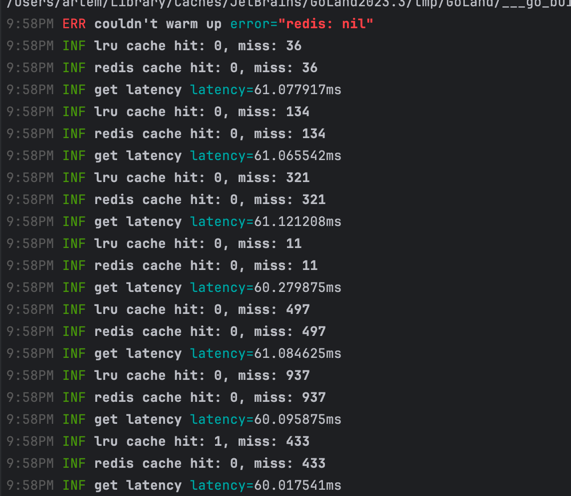
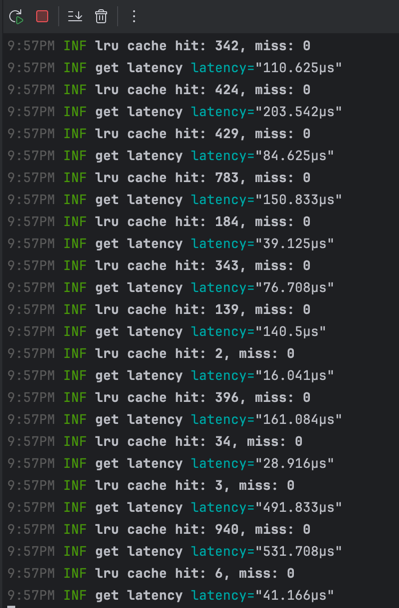
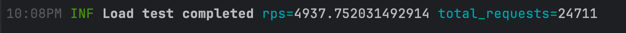

## ADR
  - Service has 2 layers of cache - LRU in-memory cache and redis cache
  - If we didn't find any keys in cache, we request and save them in async mode
  - Every 24 hours (we can set a period in UPDATE_CACHE_PERIOD_HOUR), we update date in cache
  - Every 1 hour (we can set a period in WARMUP_SAVER_PERIOD_HOUR) we save values in redis for warmup
  - In every start we request values from warmer

## Services

- **Main Service (`service`)**  
  The primary application service that exposes an API endpoint (e.g., `/api/v1/measure`).

- **Mock Service (`mock`)**  
  A mock implementation that simulates the behavior of the main service. Useful for testing purposes.

- **Load Test Service (`loadtest`)**  
  A service that performs load testing by sending randomized POST requests to the main service endpoint. It logs request details and latency metrics, including the 99th percentile latency and requests per second (RPS).

- **Cache Warmer**  
  A utility that extracts cache keys from an LRU cache and saves them into Redis under one key. This data can later be used to pre-warm the cache by issuing HTTP requests.

## Prerequisites

- [Docker](https://www.docker.com/get-started) and [Docker Compose](https://docs.docker.com/compose/)
- Go (if you wish to build locally)

## Environment Variables

The services rely on environment variables which can be provided by a `.env` file or via Docker Compose. For example:

- `PORT` - port of server
- `V1_MEASURE_TIMEOUT_MS` - server timeout
- `REDIS_ADDR` - redis url 
- `REDIS_PASSWORD` - redis password
- `REDIS_DB` - redis db
- `REDIS_CHAN_SIZE` - size of queue for an async save
- `LRU_CACHE_SIZE` - size of in-memory cache
- `LRU_CHAN_SIZE` - size of queue of in-memory cache for an async save 
- `EMISSION_URL` - url of external api
- `EMISSION_TIMEOUT_MS` - timout for external api
- `UPDATE_CACHE_PERIOD_HOUR` - how often update data in cache
- `WARMUP_SAVER_PERIOD_HOUR` - how often save data for warming up
- `NEED_TEST` - for docker-compose, true - start load test, false - don't
- `TARGET_URL` – Used by the load testing service; in Docker Compose it should be set to `http://service:8080/api/v1/measure`.

## Building and Running

### Using Makefile

A `Makefile` is provided to simplify common tasks.

- **Build all images:**

  ```bash
  make build
  
- **Run all services with Docker Compose:**

  ```bash
  make run
  
- **Clean up (stop containers and remove images):**

  ```bash
  make clean

### Using Docker Compose Directly

- **Build and run containers:**

  ```bash
  docker-compose up --build

- **View logs:**

  ```bash
  docker-compose logs -f service

- **Stop and remove containers and images:**

  ```bash
  docker-compose down --rmi all
  
## Test of result 
### Without warming up


### After warming up


### RPS
